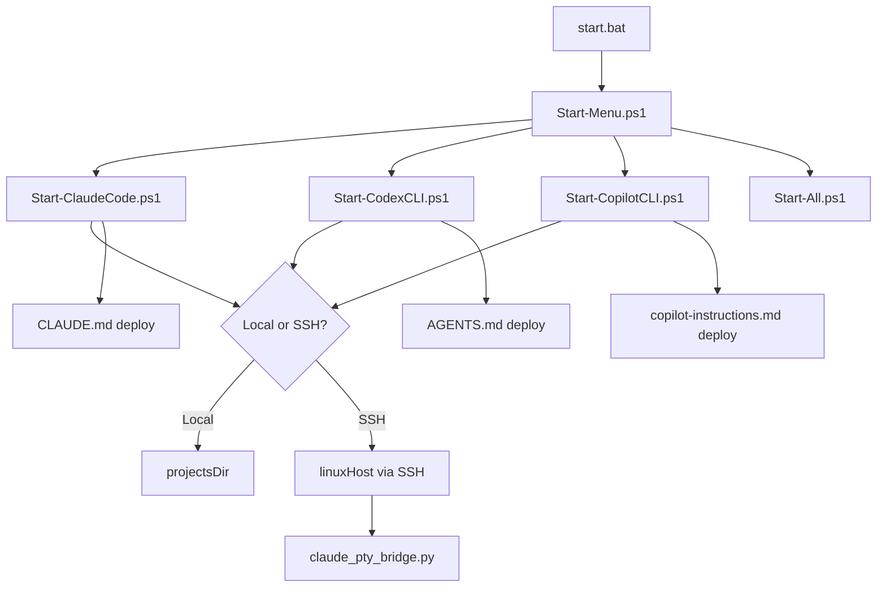
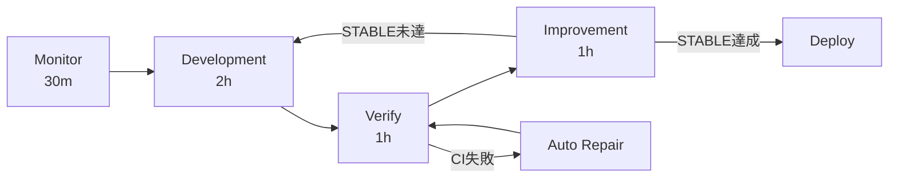
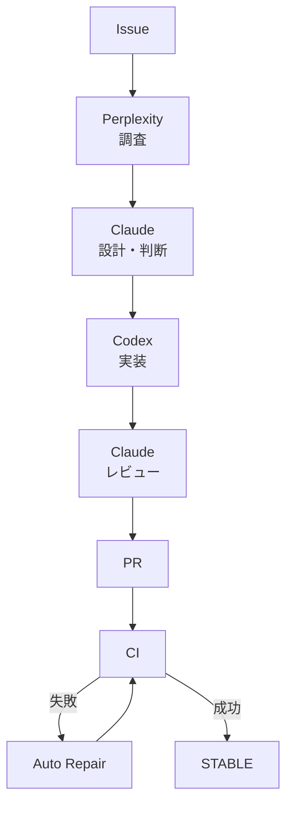

# ClaudeCLI-CodexCLI-CopilotCLI-StartUpTools

Windows から `Claude Code`、`Codex CLI`、`GitHub Copilot CLI` を統一的に起動するためのスタートアップツールです。ローカル起動と SSH リモート起動の両方に対応し、設定・診断・ガイドをこのリポジトリに集約しています。

## 対応ツール

| ツール | 提供元 | 主な用途 |
|--------|--------|---------|
| Claude Code | Anthropic | 大規模なコード修正、レビュー、実装支援 |
| Codex CLI | OpenAI | ターミナル中心のコード生成、シェル支援 |
| GitHub Copilot CLI | GitHub | `copilot --yolo` によるシェル・GitHub 操作支援 |

---

## 開発状況

| 項目 | 状態 |
|------|------|
| バージョン | v2.5.1 |
| テスト | 129/129 通過 |
| CI | SUCCESS |
| ClaudeOS | v5 (5時間最適化版) |

---

## アーキテクチャ



## 自律開発フロー（5時間最適化）



## Multi-AI Orchestration



---

## 主な機能

| 機能 | 説明 |
|------|------|
| 統一起動メニュー | `start.bat` から3ツールを対話的に選択 |
| ローカル/SSH切替 | Windows ローカルとLinux SSH の両対応 |
| テンプレート自動配備 | `CLAUDE.md` / `AGENTS.md` / `copilot-instructions.md` を自動配置 |
| ClaudeOS カーネル | 30体のエージェント + スキル + コマンド + フック |
| PTY Bridge | SSH経由のClaude Code操作を堅牢にサポート |
| 一元設定 | `config/config.json` で全ツールを統一管理 |
| 診断ツール | `Test-AllTools.ps1` で環境を一括チェック |
| CI/CD | GitHub Actions による自動テスト (Pester 129件) |

---

## クイックスタート

### 前提条件

**Windows 側:**
- Windows 10/11
- PowerShell 5.1 以上
- Node.js 18 以上
- Git / SSH クライアント

**Linux 側（SSH 起動時）:**
- `claude` / `codex` / `copilot` を実行できる環境
- SSH 鍵認証

### セットアップ

```cmd
git clone <repository-url> D:\ClaudeCLI-CodexCLI-CopilotCLI-StartUpTools-New
cd D:\ClaudeCLI-CodexCLI-CopilotCLI-StartUpTools-New
copy config\config.json.template config\config.json
```

`config/config.json` を環境に合わせて編集:

```json
{
  "projectsDir": "D:\\",
  "sshProjectsDir": "Z:\\",
  "linuxHost": "your-linux-host",
  "linuxBase": "/mnt/LinuxHDD",
  "tools": { "defaultTool": "claude" }
}
```

ツールインストール:

```powershell
npm install -g @anthropic-ai/claude-code
npm install -g @openai/codex
npm install -g @githubnext/github-copilot-cli
```

---

## 使用方法

### 対話メニュー

```cmd
start.bat
```

| メニュー | 説明 |
|----------|------|
| `S1` | Claude Code を SSH 起動 |
| `S2` | Codex CLI を SSH 起動 |
| `S3` | GitHub Copilot CLI を SSH 起動 |
| `L1` | Claude Code をローカル起動 |
| `L2` | Codex CLI をローカル起動 |
| `L3` | GitHub Copilot CLI をローカル起動 |
| `5` | ツール確認・診断 |

### PowerShell から直接起動

```powershell
.\scripts\main\Start-All.ps1
.\scripts\main\Start-ClaudeCode.ps1 -Project "my-project"
.\scripts\main\Start-CodexCLI.ps1 -Project "my-project"
.\scripts\main\Start-CopilotCLI.ps1 -Project "my-project" -Local
```

---

## ClaudeOS v5 自律開発システム（5時間最適化版）

### ループ構成

| ループ | 時間 | 責務 | 禁止事項 |
|--------|------|------|----------|
| Monitor | 30m | 要件・設計・状態確認、タスク分解 | 実装・修復 |
| Development | 2h | 設計、実装、テスト追加 | main 直接 push |
| Verify | 1h | test/lint/build/CI確認、STABLE判定 | 未テスト merge |
| Improvement | 1h | リファクタリング、docs更新 | 破壊的変更 |

### STABLE 判定条件

| 条件 | 必須 |
|------|------|
| install | SUCCESS |
| lint | SUCCESS |
| test | SUCCESS |
| build | SUCCESS |
| CI | SUCCESS |
| error count | 0 |
| security issue | 0 |

### Agent Teams

| ロール | 責務 |
|--------|------|
| CTO | 優先順位判断、5時間制御 |
| Architect | アーキテクチャ設計、責務分離 |
| Developer | 実装、修正、修復 |
| Reviewer | コード品質、差分確認 |
| QA | テスト、回帰確認 |
| Security | 脆弱性・権限確認 |
| DevOps | CI/CD・PR・Deploy制御 |

### CI Manager（自動修復）

- CI失敗は必ず失敗として扱う（成功偽装禁止）
- 修復は最小差分、1修復 = 1仮説
- 最大15回リトライ、同一エラー3回 → Blocked

---

## 設定の要点

| キー | 説明 |
|------|------|
| `projectsDir` | ローカル参照用のプロジェクトルート |
| `sshProjectsDir` | SSH 実行時に Windows 側で参照する共有ドライブ |
| `linuxHost` | SSH 接続先 |
| `linuxBase` | Linux 側のプロジェクトルート |
| `tools.defaultTool` | `Start-All.ps1` のデフォルトツール |

---

## ディレクトリ構成

```text
config/              設定テンプレートと設定ドキュメント
docs/                利用ガイド（共通/Claude/Codex/Copilot）
scripts/lib/         共通モジュール
scripts/main/        起動スクリプト
scripts/helpers/     PTY bridge 等のヘルパー
scripts/templates/   各ツール向けテンプレート
scripts/test/        診断スクリプト
tests/               Pester テスト（129件）
Claude/              ClaudeOS 互換ポリシー群
Codex/               Codex AGENTS.md
.claude/claudeos/    ClaudeOS カーネル（204ファイル）
.codex/              Codex 設定
.github/             Copilot 設定 / CI ワークフロー
```

---

## 診断とテスト

```powershell
# 全ツール診断
.\scripts\test\Test-AllTools.ps1

# JSON 出力
.\scripts\test\Test-AllTools.ps1 -OutputFormat Json

# MCP ランタイムテスト
pwsh -NoProfile -File .\scripts\test\Test-McpRuntime.ps1 -OutputFormat Json

# Pester テスト（129件）
Invoke-Pester .\tests\
```

---

## ドキュメント

| カテゴリ | ファイル |
|----------|----------|
| 共通 | `docs/common/01_はじめに.md` 〜 `13_グローバル設定適用設計.md` |
| Claude | `docs/claude/01_概要.md` 〜 `05_ベストプラクティス.md` |
| Codex | `docs/codex/01_概要.md` 〜 `04_ベストプラクティス.md` |
| Copilot | `docs/copilot/01_概要.md` 〜 `04_ベストプラクティス.md` |

---

## 注意事項

- `Claude Code` は設定上 `--dangerously-skip-permissions` を利用できます。開発環境専用です。
- API キーをソースに保存しないでください。
- SSH 実行では Linux 側の `linuxBase` と Windows 側の共有パスが同じプロジェクト群を指す前提です。

## ライセンス

MIT License
