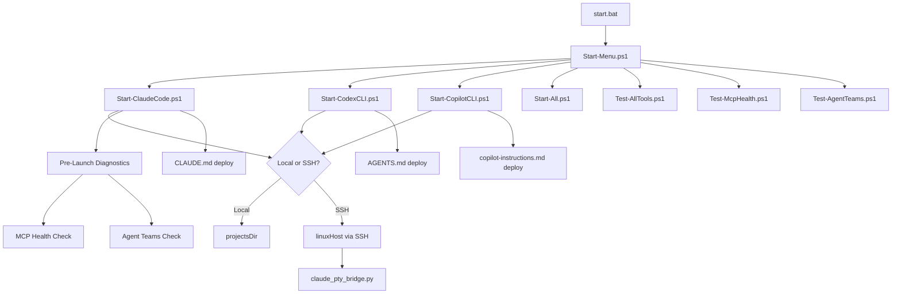
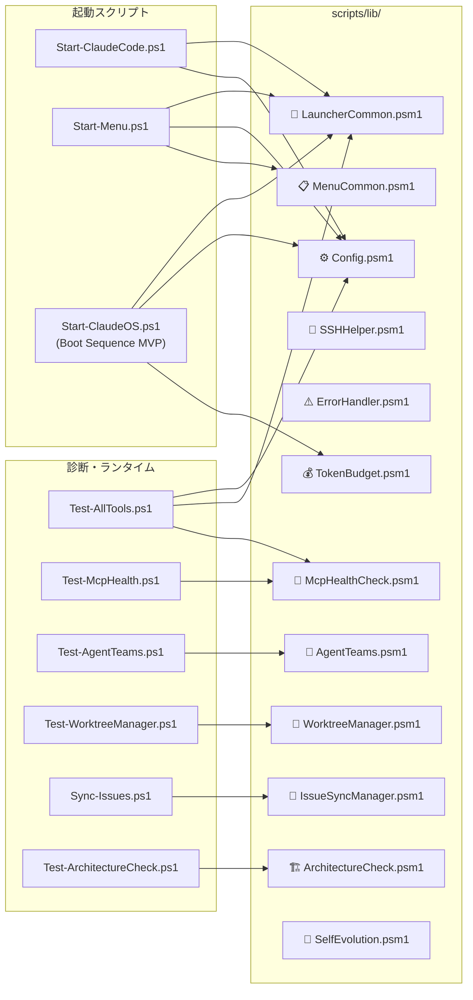
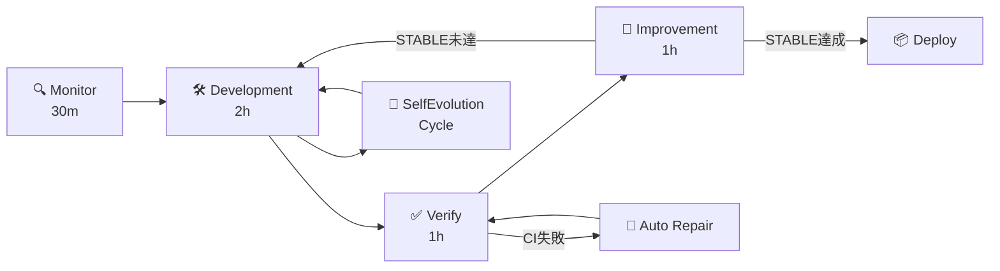
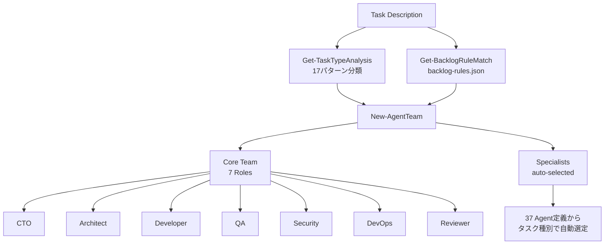
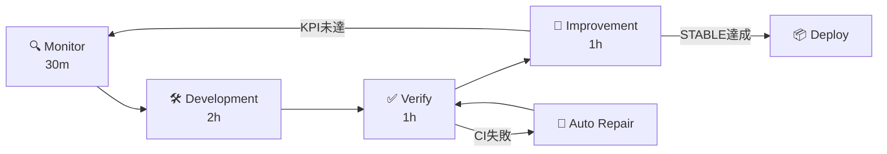

# Claude Code Autonomous Development StartUp Tools

> Windows から **Claude Code** を中心とした自律開発環境を立ち上げるためのスタートアップツールです。

`ClaudeOS v7.5` (Agent Teams / Boot Sequence / Self Evolution / Architecture Check / Issue Factory / CodeRabbit Review) をカーネルに据え、ローカル起動・SSH リモート起動・診断・Pester テスト・GitHub Issues / Projects / Actions 連携を一括提供します。

> **📌 リポジトリ名について**
> リポジトリ名 `ClaudeCLI-CodexCLI-CopilotCLI-StartUpTools-New` は当初の 3 ツール統合ランチャー構想に由来しますが、現在の開発投資・新機能 (ClaudeOS v7.5 / Phase 3 完了) はすべて **Claude Code** 側に集中しています。Codex CLI / GitHub Copilot CLI の起動スクリプトもリポジトリ内に併設してありますが、ClaudeOS フレームワークと統合されているのは Claude Code のみです。

## 対応ツール

| ツール | 提供元 | 位置付け | 主な用途 |
|--------|--------|---------|---------|
| 🌟 **Claude Code** | Anthropic | **主軸** — ClaudeOS v7.5 統合 / Agent Teams / Boot Sequence / 自律開発ループ | 大規模なコード修正、レビュー、自律開発、Issue/PR 自動化 |
| Codex CLI | OpenAI | 併設 (基本起動のみ) | ターミナル中心のコード生成、シェル支援 |
| GitHub Copilot CLI | GitHub | 併設 (基本起動のみ) | `copilot --yolo` によるシェル・GitHub 操作支援 |

> Codex CLI / GitHub Copilot CLI は `Start-CodexCLI.ps1` / `Start-CopilotCLI.ps1` で起動可能ですが、Pre-Launch Diagnostics や AgentTeams ランタイムなどの ClaudeOS 拡張機能は Claude Code 専用です。

---

## 開発状況

| 項目 | 状態 |
|------|------|
| バージョン | v2.9.0 |
| テスト | 311 Pester テスト (CI) |
| CI | ✅ SUCCESS |
| ClaudeOS (Claude Code 専用) | v7.5 (完全無人運用 + Boot Sequence 完全実装 + CodeRabbit 統合 + Memory MCP + Dashboard) |
| Agents | 37体の特化サブエージェント |
| Skills | 64個のワークフロー定義 |
| Boot Sequence | `Start-ClaudeOS.ps1` (Step 3 Memory/Step 7 Agent Init/Step 9 Dashboard 実装完了) ✅ |

### Agent Teams 対応レベル (Claude Code 専用)

> Codex CLI / GitHub Copilot CLI には適用されません。

| 機能 | レベル | 説明 |
|------|--------|------|
| Orchestrator | 3 | 起動フロー中心 |
| Project Switch | 3 | プロジェクト選択・記録・ソート |
| Monitor / Verify Loop | 3 | テスト・CI 統合 |
| Agent Teams 可視化 | 4 | ランタイムエンジン + 能力マトリクス表示 |
| MCP サーバー連携 | 4 | モジュール化・メニュー統合・ランタイムプローブ |
| Pre-Launch Diagnostics | 4 | 起動前 MCP/Agent 自動チェック |
| Worktree Manager | 3 | WorktreeManager.psm1 実装済み |
| Backlog Manager | 3 | IssueSyncManager.psm1 双方向同期 |
| Issue Sync CI/Hooks | 4 | issue-sync.yml 自動同期 + CI 検証 |
| Self Evolution | 3 | SelfEvolution.psm1 セッション学習ループ実装済み |
| Architecture Check | 3 | ArchitectureCheck.psm1 違反自動検出実装済み |

### ClaudeOS エージェント構成

| ドメイン | Agent数 | 主なエージェント |
|----------|---------|-----------------|
| Core Team | 5 | planner, architect, orchestrator, loop-operator, chief-of-staff |
| Quality | 8 | code-reviewer, security-reviewer, tdd-guide, qa, e2e-runner |
| Language | 7 | typescript, python, go, java, kotlin, rust, cpp reviewer |
| Build | 7 | build-error-resolver, go/java/kotlin/rust/cpp/pytorch resolver |
| Infrastructure | 7 | ops, release-manager, security, database-reviewer, dev-api/ui |
| Documentation | 3 | doc-updater, docs-lookup, incident-triager |

### Skills 構成 (64個)

| カテゴリ | 数 | 例 |
|----------|------|-----|
| コーディング規約 | 5 | coding-standards, java/cpp-coding-standards |
| 言語パターン | 12 | golang, python, perl, springboot, django, laravel patterns |
| テスト | 8 | tdd-workflow, e2e-testing, golang/python/cpp/perl testing |
| セキュリティ | 5 | security-review, security-scan, django/laravel/springboot security |
| インフラ | 4 | deployment-patterns, docker-patterns, database-migrations, postgres |
| ビジネス | 5 | article-writing, content-engine, market-research, investor-* |
| AI/ML | 3 | cost-aware-llm-pipeline, content-hash-cache, regex-vs-llm |
| Apple/Swift | 4 | liquid-glass-design, foundation-models, swift-concurrency/actor/di |
| 学習/改善 | 6 | continuous-learning v1/v2, autonomous-loops, verification-loop |
| その他 | 12 | videodb, clickhouse-io, api-design, search-first 等 |

---

## アーキテクチャ



## モジュール構成



## 自律開発フロー



## Agent Teams ランタイム



---

## 主な機能

> 凡例: ⭐ = Claude Code 専用 (ClaudeOS v7.4 拡張)、🔧 = 全対応ツール共通

| 機能 | 区分 | 説明 |
|------|------|------|
| 🖥️ 起動メニュー | 🔧 共通 | `start.bat` から対応ツールを対話的に選択 |
| 🔀 ローカル/SSH切替 | 🔧 共通 | Windows ローカルと Linux SSH の両対応 |
| 📄 テンプレート自動配備 | 🔧 共通 | `CLAUDE.md` / `AGENTS.md` / `copilot-instructions.md` を自動配置 |
| 🐍 PTY Bridge | 🔧 共通 | SSH経由の Claude Code 操作を堅牢にサポート |
| ⚙️ 一元設定 | 🔧 共通 | `config/config.json` で対応ツールを一元管理 |
| 🩺 診断ツール | 🔧 共通 | `Test-AllTools.ps1` で環境を一括チェック |
| ⚡ CI/CD | 🔧 共通 | GitHub Actions による自動テスト (Pester 307件) |
| 🧠 ClaudeOS カーネル | ⭐ Claude 専用 | 37体のエージェント + 64スキル + 35コマンド + フック |
| 🔌 MCP ヘルスチェック | ⭐ Claude 専用 | `McpHealthCheck.psm1` で4サーバーの起動・接続・状態診断 |
| 🤖 Agent Teams ランタイム | ⭐ Claude 専用 | `AgentTeams.psm1` でタスク分析→Team自動構成→能力マトリクス→可視化 |
| 🏁 Pre-Launch Diagnostics | ⭐ Claude 専用 | Claude Code 起動前に MCP/Agent 状態を自動チェック |
| 🌿 Worktree Manager | ⭐ Claude 専用 | `WorktreeManager.psm1` でGit Worktreeの作成・切替・削除を自動管理 |
| 🔄 Issue/Backlog 同期 | ⭐ Claude 専用 | `IssueSyncManager.psm1` でGitHub Issues ↔ TASKS.md 双方向同期 |
| 💰 Token Budget Manager | ⭐ Claude 専用 | `TokenBudget.psm1` でフェーズ別トークン使用量の自動制御 |
| 🧠 Self Evolution | ⭐ Claude 専用 | `SelfEvolution.psm1` でセッション学習ループ・改善記録の自動化 🆕 |
| 🏗️ Architecture Check | ⭐ Claude 専用 | `ArchitectureCheck.psm1` でアーキテクチャ違反・禁止パターンの自動検出 🆕 |
| 🚀 ClaudeOS Boot Sequence | ⭐ Claude 専用 | `Start-ClaudeOS.ps1` で `.claude/claudeos/system/boot.md` 仕様の 9 ステップ初期化（MVP: Step 1/2/4/9 実装、Step 3/5/6/7/8 はプレースホルダー）🆕 |
| 🔎 MCP ランタイムプローブ | ⭐ Claude 専用 | `Invoke-McpRuntimeProbe` で MCP サーバーの起動テストを実行 |

---

## クイックスタート

### 前提条件

**Windows 側:**
- Windows 10/11
- PowerShell 5.1 以上
- Node.js 18 以上
- Git / SSH クライアント

**Linux 側（SSH 起動時）:**
- `claude` / `codex` / `copilot` を実行できる環境
- SSH 鍵認証

### セットアップ

```cmd
git clone <repository-url> D:\ClaudeCLI-CodexCLI-CopilotCLI-StartUpTools-New
cd D:\ClaudeCLI-CodexCLI-CopilotCLI-StartUpTools-New
copy config\config.json.template config\config.json
```

`config/config.json` を環境に合わせて編集:

```json
{
  "projectsDir": "D:\\",
  "sshProjectsDir": "auto",
  "linuxHost": "your-linux-host",
  "linuxBase": "/home/kensan/Projects",
  "tools": { "defaultTool": "claude" }
}
```

ツールインストール:

```powershell
# 必須 (主軸)
npm install -g @anthropic-ai/claude-code

# 任意 (併設ランチャーを使う場合のみ)
npm install -g @openai/codex
npm install -g @githubnext/github-copilot-cli
```

---

## 使用方法

### 対話メニュー

```cmd
start.bat
```

| メニュー | 説明 |
|----------|------|
| `S1` | Claude Code を SSH 起動 |
| `S2` | Codex CLI を SSH 起動 |
| `S3` | GitHub Copilot CLI を SSH 起動 |
| `L1` | Claude Code をローカル起動 |
| `L2` | Codex CLI をローカル起動 |
| `L3` | GitHub Copilot CLI をローカル起動 |
| `5` | ツール確認・診断 |
| `6` | ドライブマッピング診断 |
| `7` | Windows Terminal セットアップ |
| `8` | MCP ヘルスチェック |
| `9` | Agent Teams ランタイム |
| `10` | Worktree Manager |
| `11` | 🆕 Architecture Check |

### PowerShell から直接起動

```powershell
# AI CLI ツール起動
.\scripts\main\Start-All.ps1
.\scripts\main\Start-ClaudeCode.ps1 -Project "my-project"
.\scripts\main\Start-CodexCLI.ps1 -Project "my-project"
.\scripts\main\Start-CopilotCLI.ps1 -Project "my-project" -Local

# ClaudeOS Boot Sequence (MVP) 🆕
.\scripts\main\Start-ClaudeOS.ps1                    # 9ステップ初期化
.\scripts\main\Start-ClaudeOS.ps1 -DryRun            # 非破壊プレビュー
.\scripts\main\Start-ClaudeOS.ps1 -NonInteractive    # CI / 自動実行向け
```

---

## ClaudeOS v7.4 完全無人運用システム (Claude Code 専用)

> **本セクションの全機能は Claude Code 上でのみ動作します。** Codex CLI / GitHub Copilot CLI には適用されません。`Start-ClaudeOS.ps1` および `.claude/claudeos/` 配下のカーネル文書群が前提です。

### v7.4 新機能

| 機能 | 説明 |
|------|------|
| 🏭 AI Dev Factory | CI/Review/KPI結果から Issue を自動生成し GitHub Projects へ反映 |
| 🧮 Priority Intelligence | `state.json` のウェイトベースで優先順位をスコア計算 |
| 🧭 Auto Loop Intelligence | KPI/CI 状態に基づく動的ループ回数制御 |
| 📊 全プロセス可視化 | Agent Teams ログ・フェーズ遷移・KPI を常時表示 |
| 🔗 GitHub Projects 連携 | Issue 状態と Project ステータスの自動同期 |

### 自律ループ構成



| ループ | 時間 | 責務 | 禁止事項 |
|--------|------|------|----------|
| Monitor | 30m | 要件・設計・状態確認、タスク分解 | 実装・修復 |
| Development | 2h | 設計、実装、テスト追加 | main 直接 push |
| Verify | 1h | test/lint/build/CI確認、STABLE判定 | 未テスト merge |
| Improvement | 1h | リファクタリング、docs更新 | 破壊的変更 |

### STABLE 判定条件

| 条件 | 必須 |
|------|------|
| install | SUCCESS |
| lint | SUCCESS |
| test | SUCCESS |
| build | SUCCESS |
| CI | SUCCESS |
| Codex Review | OK |
| error count | 0 |
| security issue | 0 |

### Agent Teams（12ロール）

| ロール | 責務 |
|--------|------|
| CTO | 最終判断、優先順位、時間制御 |
| ProductManager | Issue 生成、要件整理 |
| Architect | アーキテクチャ設計、責務分離 |
| Developer | 実装、修正、修復 |
| Reviewer | Codex レビュー、差分確認 |
| Debugger | 原因分析、Codex rescue |
| QA | テスト、回帰確認 |
| Security | 脆弱性・権限確認 |
| DevOps | CI/CD・PR・Deploy制御 |
| Analyst | KPI 分析、メトリクス評価 |
| EvolutionManager | 改善提案、自己進化管理 |
| ReleaseManager | リリース管理、マージ判断 |

### CI Manager（自動修復）

- CI失敗は必ず失敗として扱う（成功偽装禁止）
- 修復は最小差分、1修復 = 1仮説
- 最大15回リトライ、同一エラー3回で Blocked

---

## 設定の要点

| キー | 説明 |
|------|------|
| `projectsDir` | ローカル参照用のプロジェクトルート |
| `sshProjectsDir` | SSH 実行時の共有ドライブ (`"auto"` で空きレター自動検出) |
| `linuxHost` | SSH 接続先 |
| `linuxBase` | Linux 側のプロジェクトルート |
| `tools.defaultTool` | `Start-All.ps1` のデフォルトツール |

---

## ディレクトリ構成

```text
config/              設定テンプレートと設定ドキュメント
docs/                利用ガイド（共通/Claude/Codex/Copilot）
scripts/lib/         共通モジュール (9 modules)
  Config.psm1          設定管理
  LauncherCommon.psm1  起動共通処理
  MenuCommon.psm1      メニュー共通処理
  SSHHelper.psm1       SSH接続ヘルパー
  ErrorHandler.psm1    エラーハンドリング
  McpHealthCheck.psm1  MCPヘルスチェック
  AgentTeams.psm1      Agent Teamsランタイム
  WorktreeManager.psm1 Git Worktree管理
  IssueSyncManager.psm1 Issue/Backlog同期
  TokenBudget.psm1     Token Budget自動制御
  ArchitectureCheck.psm1 アーキテクチャ違反検出 [NEW Phase3]
  SelfEvolution.psm1   セッション学習・自己進化 [NEW Phase3]
scripts/main/        起動スクリプト
scripts/helpers/     PTY bridge 等のヘルパー
scripts/templates/   各ツール向けテンプレート
scripts/test/        診断スクリプト
scripts/tools/       TASKS同期・バックログ管理
tests/               Pester テスト (15 files / 307件)
Claude/              ClaudeOS 互換ポリシー群
Codex/               Codex AGENTS.md
.claude/claudeos/    ClaudeOS カーネル（204ファイル）
.codex/              Codex 設定
.github/             Copilot 設定 / CI ワークフロー
```

---

## 診断とテスト

```powershell
# 全ツール診断
.\scripts\test\Test-AllTools.ps1

# MCP ヘルスチェック
.\scripts\test\Test-McpHealth.ps1

# Agent Teams ランタイム診断
.\scripts\test\Test-AgentTeams.ps1

# Architecture Check (Phase 3) 🆕
.\scripts\test\Test-ArchitectureCheck.ps1

# JSON 出力
.\scripts\test\Test-AllTools.ps1 -OutputFormat Json
.\scripts\test\Test-McpHealth.ps1 -OutputFormat Json
.\scripts\test\Test-AgentTeams.ps1 -OutputFormat Json -Task "Fix CI build"
.\scripts\test\Test-ArchitectureCheck.ps1 -OutputFormat Json

# Pester テスト (307件)
Invoke-Pester .\tests\
```

---

## ドキュメント

| カテゴリ | ファイル |
|----------|----------|
| 共通 | `docs/common/01_はじめに.md` 〜 `13_グローバル設定適用設計.md` |
| Claude | `docs/claude/01_概要.md` 〜 `05_ベストプラクティス.md` |
| Codex | `docs/codex/01_概要.md` 〜 `04_ベストプラクティス.md` |
| Copilot | `docs/copilot/01_概要.md` 〜 `04_ベストプラクティス.md` |

---

## 開発ロードマップ (v3.0.0) — Claude Code 専用

> Phase 2 以降のすべてのロードマップ項目は Claude Code / ClaudeOS スタック向けです。Codex CLI / GitHub Copilot CLI の機能拡張は本ロードマップに含まれません。

| フェーズ | 状態 | 主な目標 |
|----------|------|----------|
| Phase 1 ✅ | 完了 (v2.7.0) | P1完了、モジュール基盤確立 |
| Phase 2 ✅ | 完了 (v2.8.0) | Worktree並列開発、Issue自動生成、CI強化 |
| Phase 3 🚧 | 進行中 (v2.9.0 安定) | Self Evolution / Architecture Check 完了、Boot Sequence MVP 着手、Dashboard UI / Memory MCP は未着手 |
| Phase 4 ⏸ | 未着手 (v3.0.0) | リリース準備、セキュリティ監査、GA |

### Phase 3 進捗 (v2.9.0)

| タスク | 担当 | 状態 |
|--------|------|------|
| 🧠 Self Evolution システム | Architect | ✅ 完了 (#50) |
| 🏗️ Architecture Check Loop | Architect | ✅ 完了 (#49) |
| 📊 開発ダッシュボード UI | Developer | ⏸ Planned |
| 💾 Memory MCP 永続化統合 | Ops | ⏸ Planned |
| 🔧 Boot Sequence 完全自動化 | Ops | 🚧 進行中 — MVP PR-A 実装済み (#69, Issue #68) |

**Phase 3 完了率: 2/5 (40%) + Boot Sequence MVP 着手**

### 最近のマージ履歴

| PR | 内容 | 日付 |
|----|------|------|
| #69 | feat(boot): ClaudeOS Boot Sequence scaffold (MVP / PR-A) | 2026-04-10 |
| #67 | fix: markdownlint MD024 を file-scoped inline disable 化 | 2026-04-10 |
| #66 | fix: START_PROMPT テンプレを最大10回ループ + CTO全権委任に明確化 | 2026-04-10 |
| #65 | fix: 残りの曖昧文言を具体的トリガー条件に置換 | 2026-04-10 |
| #64 | fix: 6つの実行指示を具体的トリガー条件付きに明確化 | 2026-04-10 |
| #63 | fix: ループ上限・Token閾値を明示化 — 無限ループ防止強化 | 2026-04-10 |
| #62 | fix: 自律継続ルール追加 — フェーズ間のユーザー確認停止を禁止 | 2026-04-10 |
| #61 | refactor: START_PROMPT.md を分割ファイル化 + ビルドスクリプト | 2026-04-09 |
| #58 | プロジェクト構造の全面改善（15項目） | 2026-04-09 |
| #54 | SSH 20分フリーズ防止（ServerAliveInterval 追加） | 2026-04-08 |
| #51 | Phase 3 — Self Evolution + Architecture Check Loop | 2026-04-08 |

---

## 注意事項

- `Claude Code` は設定上 `--dangerously-skip-permissions` を利用できます。開発環境専用です。
- API キーをソースに保存しないでください。
- SSH 実行では Linux 側の `linuxBase` と Windows 側の共有パスが同じプロジェクト群を指す前提です。

## ライセンス

MIT License
