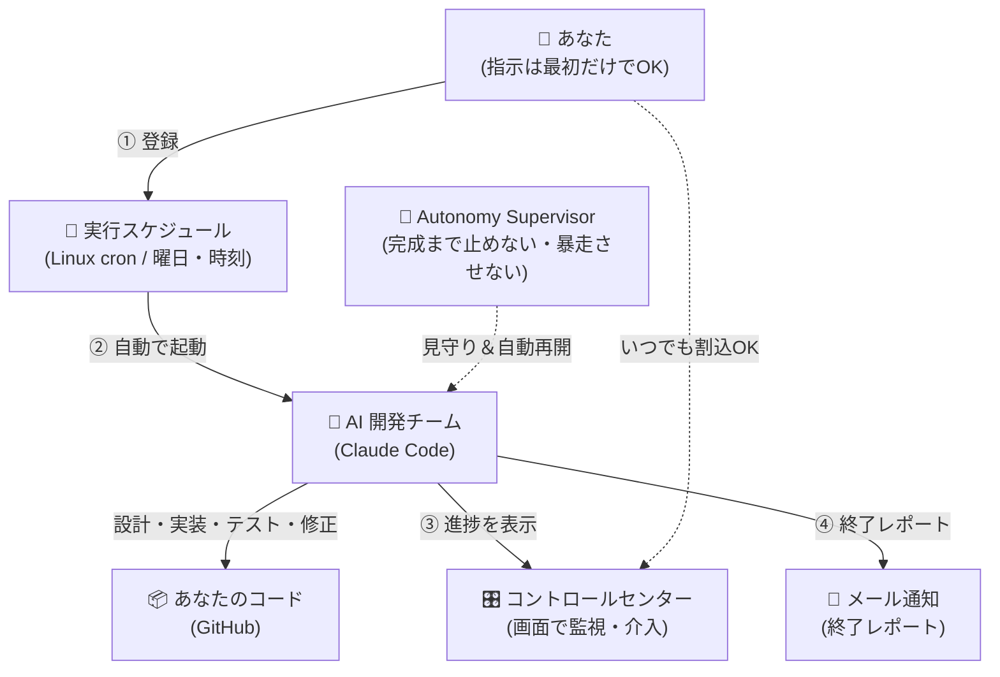
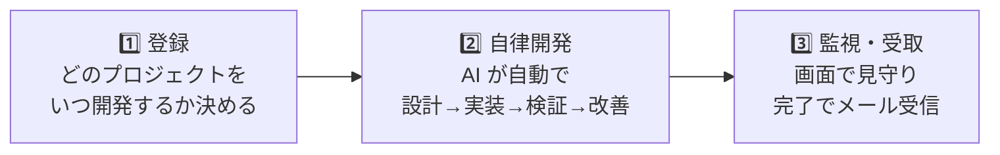
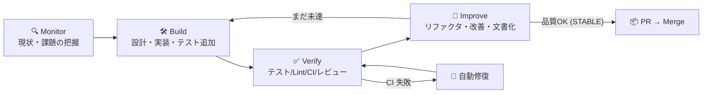
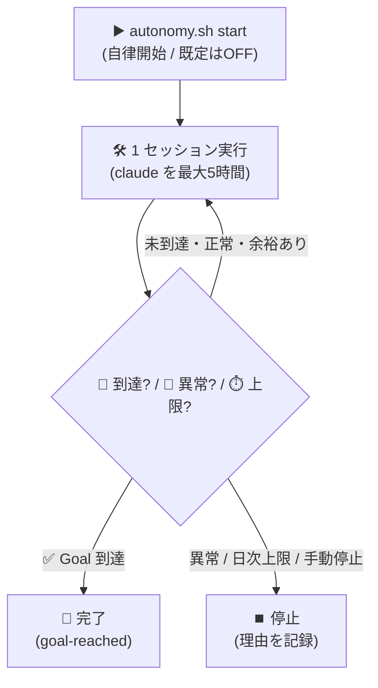
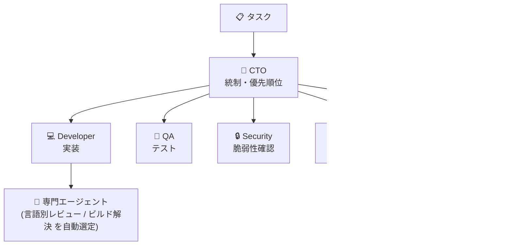

# 🤖 ClaudeOS — あなたの代わりに開発する「AI 開発チーム」

> 🌟 **ひとことで言うと**: 1 台の Linux マシンに住み込む “AI のソフトウェア開発チーム” です。
> あなたが「このプロジェクトを、この曜日・時刻に進めて」と登録しておくだけで、AI（Claude Code）が
> **設計 → 実装 → テスト → 修正 → レビュー → Pull Request** までを自動でこなします。
> 進み具合は画面で見守れ、口を挟みたいときはいつでも割り込め、終わればメールで報告が届きます。

`ClaudeOS v9.0` をカーネルに、**完全自律実行**・**インタラクティブ TUI（操作画面）**・**メール通知**・
**Web ダッシュボード**・**GitHub 連携** を 1 つにまとめた、Linux 向けの自律開発スタートアップツールです。

---

## 📖 はじめに（エンジニアでなくても大丈夫）

> 💡 **たとえ話**: 優秀な開発チーム（CTO・実装担当・テスト担当・セキュリティ担当…）を 1 人雇って、
> 「このアプリ、完成まで進めておいて」とお願いするイメージです。チームは自分たちで段取りを決めて働き、
> 行き詰まったら自分で直し、危ないこと（暴走・無駄遣い）はしないよう **自動ブレーキ** が掛かっています。

| ❓ よくある疑問 | ✅ 答え |
|---|---|
| プログラミングの知識は必要？ | 起動と監視は**メニューを選ぶだけ**。中身の開発は AI が担当します。 |
| ずっと見ていないとダメ？ | いいえ。登録すれば**自動で動き**、終われば**メールが届きます**。 |
| 勝手に暴走しない？ | しません。**時間・回数・コストの上限**と**停止条件**が常に効いています（後述）。 |
| 途中で口を出せる？ | はい。コントロールセンターから**いつでも画面に入って指示**でき、抜ければまた自律に戻ります。 |

---

## 🗺️ ひと目でわかる全体像


```mermaid
flowchart TB
    You["👤 あなた<br/>(指示は最初だけでOK)"]
    Reg["📅 実行スケジュール<br/>(Linux cron / 曜日・時刻)"]
    AI["🤖 AI 開発チーム<br/>(Claude Code)"]
    Repo["📦 あなたのコード<br/>(GitHub)"]
    TUI["🎛️ コントロールセンター<br/>(画面で監視・介入)"]
    Mail["📧 メール通知<br/>(終了レポート)"]
    Sup["🔁 Autonomy Supervisor<br/>(完成まで止めない・暴走させない)"]

    You -->|"① 登録"| Reg
    Reg -->|"② 自動で起動"| AI
    AI -->|"設計・実装・テスト・修正"| Repo
    AI -->|"③ 進捗を表示"| TUI
    AI -->|"④ 終了レポート"| Mail
    Sup -. "見守り＆自動再開" .-> AI
    You -. "いつでも割込OK" .-> TUI
```

## 🚦 3 ステップで動きます


```mermaid
flowchart LR
    S1["1️⃣ 登録<br/>どのプロジェクトを<br/>いつ開発するか決める"]
    S2["2️⃣ 自律開発<br/>AI が自動で<br/>設計→実装→検証→改善"]
    S3["3️⃣ 監視・受取<br/>画面で見守り<br/>完了でメール受信"]
    S1 --> S2 --> S3
```

---

## 🧩 主要コンセプトをやさしく

| アイコン | 名前 | かんたん説明 |
|---|---|---|
| 👔 | **CTO（最高技術責任者）** | AI チームのリーダー。何を優先し、続けるか止めるかを判断します。 |
| 🎯 | **Goal（ゴール）** | 「ここまでできたら完成」という到達条件。AI はこれを目指して働きます。 |
| 🤝 | **Agent Teams** | 役割の違う AI（実装・テスト・セキュリティ…）が**チームで並行作業**する仕組み。 |
| 🔁 | **Autonomy Supervisor** | **Goal 到達まで止めずに自動で再開**し続ける見守り役。暴走しないよう自動ブレーキ付き。 |
| 🎛️ | **コントロールセンター** | 全プロジェクトの状況を 1 画面で見て、起動・停止・割り込みができる操作盤（TUI）。 |
| ⏰ | **Linux cron** | 「月〜土の何時に動かす」という**自動起動のタイマー**。 |
| 📧 | **メールレポート** | セッション終了時に、成果サマリを**HTML メール**でお届け。 |
| 🌐 | **Mission Control** | ブラウザで見られる**Web ダッシュボード**（進捗・CI・健全性）。 |

---

## 🔄 AI はこう働きます（自律開発ループ）

> AI は人間の開発者と同じように、**確認 → 作る → 試す → 良くする** を繰り返します。
> 問題があれば自分で直し、十分な品質（STABLE）になったら Pull Request を出します。


```mermaid
flowchart LR
    M["🔍 Monitor<br/>現状・課題の把握"]
    B["🛠️ Build<br/>設計・実装・テスト追加"]
    V["✅ Verify<br/>テスト/Lint/CI/レビュー"]
    I["🚀 Improve<br/>リファクタ・改善・文書化"]
    PR["📦 PR → Merge"]
    Fix["🔧 自動修復"]
    M --> B --> V --> I
    I -->|"まだ未達"| B
    I -->|"品質OK (STABLE)"| PR
    V -->|"CI 失敗"| Fix --> V
```

| ループ | 目安 | やること |
|---|---|---|
| 🔍 Monitor | 30 分 | 要件・状態・GitHub を確認し、やることを分解 |
| 🛠️ Build | 2 時間 | 実装・テスト追加（ブランチ作業、main へ直接 push しない） |
| ✅ Verify | 1.25 時間 | テスト/Lint/ビルド/CI/レビューを確認し「STABLE」を判定 |
| 🚀 Improve | 1.25 時間 | 命名整理・リファクタ・README/ドキュメント更新 |

---

## 🔁 Autonomy Supervisor — 「止まらない、でも暴走しない」

> 🆕 **v3.4.x の目玉機能**。登録プロジェクトを **Goal/Release に到達するまで自動で再開** し続けます。
> セッションが 5 時間で終わっても、Supervisor が状況を確認して**未完なら自動でもう一度**走らせます。
> ただし、ここが肝心 — **きちんと止まるべき時には必ず止まります**。


```mermaid
flowchart TD
    Start["▶️ autonomy.sh start<br/>(自律開始 / 既定はOFF)"]
    Run["🛠️ 1 セッション実行<br/>(claude を最大5時間)"]
    Check{"🎯 到達? / 🚨 異常? / ⏱️ 上限?"}
    Done["🏁 完了<br/>(goal-reached)"]
    Stop["⏹️ 停止<br/>(理由を記録)"]
    Start --> Run --> Check
    Check -->|"未到達・正常・余裕あり"| Run
    Check -->|"✅ Goal 到達"| Done
    Check -->|"異常 / 日次上限 / 手動停止"| Stop
```

### 🛡️ 自動ブレーキ（暴走・コスト対策）

| 種類 | 止まる条件（既定） |
|---|---|
| 🎯 ゴール到達 | `deploy.ready=true` または保守/リリース済みフェーズ |
| 🚨 異常検知 | セキュリティ重大課題あり / ブロッカーあり |
| ⏱️ 日次上限 | **合計 600 分 / 再起動 6 回** を超えたら停止（`state.json` で変更可） |
| 🔂 暴走ループ | 極端に短いセッションが連続したら停止 |
| ✋ 手動 | `stop` でいつでも停止（`--now` で実行中のものも即停止） |

> 🔒 **二重起動防止**: cron と Supervisor が同時に同じプロジェクトを起こしても、`flock` により
> 後から来た方が安全に見送られます（稼働中のセッションを壊しません）。

```bash
bash bin/autonomy.sh start  <プロジェクト名>   # 自律再開を開始（バックグラウンド常駐）
bash bin/autonomy.sh status <プロジェクト名>   # 状態（再起動回数 / 稼働分 / 最終理由）
bash bin/autonomy.sh stop   <プロジェクト名>   # 停止（--now で実行中も即停止）
bash bin/autonomy.sh list                      # すべての Supervisor 一覧
```

---

## 🎛️ コントロールセンター — 1 画面で監視・操作・割り込み

> メニューで `MO` を選ぶ（または `bash bin/monitor-sessions.sh open`）と、すべての状況が 1 画面に集約されます。
> **見るだけでなく、その場で起動・停止・割り込み**ができます。

```text
 🎛️  ClaudeOS コントロールセンター  (1秒更新)        2026-06-02 12:30
 ──────────────────────────────────────────────────────────────
  ● 実行中セッション   #  プロジェクト        経過       残り
   1  WebApp                01:10:00   03:50:00  ✽   ← 数字キーで前面(介入)へ
 ──────────────────────────────────────────────────────────────
  ● 登録 / supervisor  #  プロジェクト   session  supervisor    rst/min
   1  ApiSvc               ○停止   goal-reached  1/48
   2  WebApp               ●稼働   running       3/215
 ──────────────────────────────────────────────────────────────
  [1-9]介入FG  Ctrl-b 0監視  [l]起動 [s]監督開始 [x]監督停止 [q]終了
```

| キー | できること |
|---|---|
| `1`〜`9` / `Ctrl-b <番号>` | そのプロジェクトの AI 画面に**入って直接指示**（介入） |
| `Ctrl-b 0` | コントロールセンター（監視画面）へ戻る |
| `l` | 登録から選んで**1 回だけ自律実行**（バックグラウンド） |
| `s` | 登録から選んで**Supervisor 開始**（Goal まで自動再開） |
| `x` | Supervisor 停止 |
| `q` | 画面を閉じる（AI セッションは裏で継続） |

> 💡 介入して指示し終えたら `Ctrl-b 0` で抜けるだけ。AI はそのまま自律作業に戻ります。

---

## 📧 メール通知 & 🌐 Web ダッシュボード

- 📧 **終了レポートメール**: `~/.env-claudeos` に SMTP 設定 + `CLAUDEOS_EMAIL_ENABLED=1` を置くと、
  セッション終了時に **HTML レポートメール**（成果サマリ・次フェーズ提案）が届きます。
  cron・バックグラウンド・**手動起動（L1/S1）すべて対応**。手動分だけ止めるなら `CLAUDEOS_MANUAL_EMAIL=0`。
- 🌐 **Mission Control（Web）**: `bash bin/start-dashboard.sh` で `http://localhost:3737/mission-control` を起動。
  進捗・CI・健全性をブラウザで一覧。LAN 公開時は Basic 認証を有効化できます（後述）。

---

## ⚡ クイックスタート（Linux）

### ✅ 前提条件

- 🐧 Linux（Ubuntu などの一般的なディストリビューション）
- 🤖 `claude`（Claude Code CLI） … `npm install -g @anthropic-ai/claude-code`
- 🪟 `tmux`（画面の常駐・タブ切替に使用） / `git` / `jq` / `node` (18+) / `python3`

### 🛠️ セットアップ（3 手順）

```bash
# ① 取得
git clone <repository-url> ~/Projects/ClaudeCode-StartUpTools-New
cd ~/Projects/ClaudeCode-StartUpTools-New

# ② 端末まわりを準備（tmux 設定 / 作業ディレクトリ / 日本語ロケール）
./libexec/setup-terminal.sh --apply
./libexec/setup-terminal.sh --install --yes --apply   # tmux 未導入のとき
./libexec/setup-terminal.sh --locale-ja               # 日本語表示にしたいとき

# ③ 起動（メニューが開きます）
./start.sh
```

> ⚙️ プロジェクトの置き場所などは `config/config.json`（`linuxBase` など）で調整できます。

---

## 🖱️ メニュー一覧（`./start.sh`）

| メニュー | できること |
|---|---|
| `L1` | 🖥️ ローカル即起動（フォアグラウンド / その場で AI 画面に入る） |
| `S1` | 🌙 バックグラウンド起動（自律 / 5 時間 / 裏で動かす） |
| `5`–`11` | 🩺 各種診断（ツール / ネットワーク / tmux / MCP / Agent Teams / Worktree / Architecture） |
| `12` | 📊 Statusline 設定 |
| `13` | 📡 Claude ログ監視 |
| `14` | 📅 Cron スケジュール 登録・編集・削除 / **登録から選んで一括バックグラウンド起動** |
| `15` | 📺 セッション状態監視（一覧 / 接続・停止） |
| `MO` | 🎛️ **コントロールセンター**（監視＋起動＋Supervisor＋介入 を 1 画面） |
| `PD` / `MC` | 🌐 Mission Control（Web ダッシュボード） |

> ⏰ **自動実行の仕組み**: Linux cron（月〜土 / プロジェクト別 / 1 セッション最大 5 時間）が起動トリガです。
> メニュー `14`（`bin/cron-schedule.sh`）から登録・管理します。

---

## ⌨️ CLI チートシート

```bash
# ▶️ 起動（バックグラウンド既定）
bash bin/cron-schedule.sh launch --all                 # 登録済みを全件バックグラウンド起動
bash bin/cron-schedule.sh run-now  --project A          # 1 件だけ今すぐ（既定 BG）
bash bin/cron-schedule.sh run-now  --project A --foreground   # 画面に入って同期実行

# 🔁 完全自律（Goal まで自動再開）
bash bin/autonomy.sh start  A        # 開始    /  stop A [--now] で停止
bash bin/autonomy.sh list            # 状態一覧

# 🎛️ 監視・介入
bash bin/monitor-sessions.sh open    # コントロールセンターを開く
tmux attach -t claudeos-A            # 特定プロジェクトの AI 画面に直接入る

# 📅 スケジュール登録
bash bin/cron-schedule.sh add --project A --time 21:00 --dow 1,2,3,4,5,6
```

---

## 📊 開発状況

| 項目 | 状態 |
|------|------|
| バージョン | **v3.4.2** — 二重起動防止ロック + Autonomy Supervisor 完成（Phase 1〜3） / 旧: v3.4.1 |
| 実行基盤 | 🐧 **Linux ネイティブ**（`start.sh` / `bin/*.sh` / tmux / cron） |
| テスト | ✅ **bats 194 件**（Linux）+ **Pester**（pwsh / Windows CI）/ shellcheck 0 |
| CI | ✅ SUCCESS（ShellCheck+bats / test-and-validate / Secrets / PSScriptAnalyzer / CodeRabbit） |
| ClaudeOS | **v9.0**（`/goal` 駆動 / Agent Teams A・B・C / Agent View / 動的判断 / 週次フェーズ制御 / Stop Conditions） |
| Agents | **44体** の特化サブエージェント（CTO・開発・QA・Security・レビュー・ビルド解決・CMDB・監査…） |
| Hooks | **4個**（session-start / pre-compact / session-end / usage-tracker） |
| Commands / Skills | **42コマンド** / **2スキル**（`cto-session-start` / `webui-health-check`） |

### 🤝 Agent Teams（チーム編成の例）


```mermaid
flowchart TD
    Task["📋 タスク"] --> CTO["👔 CTO<br/>統制・優先順位"]
    CTO --> Dev["💻 Developer<br/>実装"]
    CTO --> QA["🧪 QA<br/>テスト"]
    CTO --> Sec["🔒 Security<br/>脆弱性確認"]
    CTO --> Rev["🔍 Reviewer<br/>コードレビュー"]
    CTO --> Ops["⚙️ DevOps<br/>CI/CD・PR"]
    Dev --> Spec["🧬 専門エージェント<br/>(言語別レビュー / ビルド解決 を自動選定)"]
```

| パターン | 使いどころ |
|---|---|
| **A 並列実装** | 複数機能を同時に作る（Backend / Frontend / テストを分担） |
| **B 品質強化** | CI 失敗の修復 + セキュリティ + 回帰テストを同時対応 |
| **C 調査・設計** | 新機能の設計検討（技術調査 + 設計 + 反証役） |

---

## 🗂️ ディレクトリ構成（Linux ネイティブ）

```text
start.sh                エントリ（メニューを開く）
bin/                    実行スクリプト
  menu.sh                 運用メニュー TUI
  cron-schedule.sh        Cron 登録・編集・削除 / 一括 BG 起動
  start-claude.sh         手動起動（L1/S1）
  monitor-sessions.sh     🎛️ コントロールセンター（監視＋操作）
  autonomy.sh             🔁 Autonomy Supervisor（自律再開）
  start-dashboard.sh      🌐 Mission Control(Web) 起動
lib/                    共通ライブラリ
  common.sh / json.sh / config-loader.sh / cron-manager.sh
  tmux-runner.sh          tmux 実行エンジン（手動起動）
  supervisor.sh           Supervisor 本体（ガードレール＋自律ループ）
libexec/                診断・ユーティリティ（メニュー 5〜15）
  setup-terminal.sh       tmux/端末セットアップ
  watch-session.sh        セッション状態監視
Claude/templates/linux/ cron-launcher.sh（自律セッションの起動ラッパ） / report-and-mail.py（メール）
tests/bats/             Linux 側ユニットテスト（bats）
scripts/                Mission Control(Web) / 各種ツール / Pester テスト
.claude/claudeos/       ClaudeOS カーネル（agents / commands / hooks / docs …）
~/.claudeos/            実行時データ（logs / sessions / supervisor / locks / cron-launcher.sh）
```

---

## 🔐 設定の要点

| キー（`config/config.json`） | 説明 |
|---|---|
| `linuxBase` | プロジェクトの置き場所（例 `/home/USER/Projects`） |
| `tools.defaultTool` | 既定ツール（`claude`） |
| `dashboardAuth.user` / `dashboardAuth.password` | Mission Control(Web) の Basic 認証（任意） |

```bash
# 🌐 Mission Control を LAN 公開する場合は認証を有効化（推奨）
export DASHBOARD_PASSWORD="your-secret-password"
export DASHBOARD_USER="admin"
bash bin/start-dashboard.sh        # → http://<LAN-IP>:3737 で認証を要求
```

メール送信は `~/.env-claudeos`（Git 管理外）に設定します:

```bash
export CLAUDEOS_SMTP_USER="you@gmail.com"
export CLAUDEOS_SMTP_PASS="<Gmail アプリパスワード>"
export CLAUDEOS_DEFAULT_TO="you@gmail.com"
export CLAUDEOS_EMAIL_ENABLED=1     # 0 で無効
```

---

## 🩺 診断とテスト

```bash
# Linux 側ユニットテスト（bats）
bats tests/bats/unit/

# シェルスクリプト静的解析
shellcheck -S error start.sh lib/*.sh bin/*.sh libexec/*.sh

# 各種診断（メニュー 5〜11 と同等）
bash libexec/diag-all-tools.sh      # ツール一括診断
bash libexec/diag-mcp-health.sh     # MCP ヘルスチェック
```

> 🪟 Windows/PowerShell 由来の Pester テスト（`tests/`）と Mission Control(Web) は CI で継続検証されています。

---

## 📚 ドキュメント

| カテゴリ | 場所 |
|---|---|
| 運用ポリシー（正本） | [`CLAUDE.md`](./CLAUDE.md) |
| 変更履歴 | [`CHANGELOG.md`](./CHANGELOG.md) |
| 共通ガイド | `docs/common/` |
| Claude / Codex / Copilot ガイド | `docs/claude/` ほか |

---

## ⚠️ 注意事項

- 🔓 `Claude Code` は `--dangerously-skip-permissions` を利用します（**開発環境専用**）。
- 🔑 API キー・パスワードは**ソースに保存しない**でください（`~/.env-claudeos` 等の Git 管理外へ）。
- 🤖 Autonomy Supervisor は**既定 OFF**。`start` した時だけ自律再開します。

## 📄 ライセンス

MIT License
