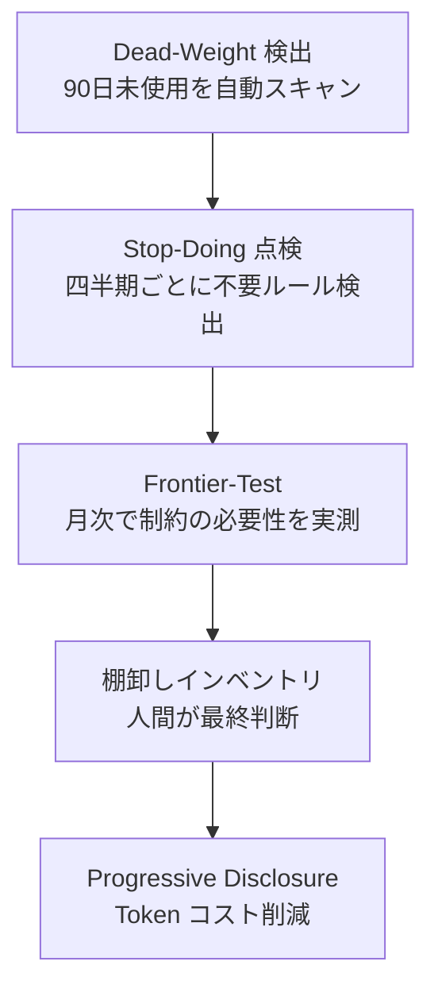

# v3.0.0 リリースノート（ドラフト）

**コードネーム**: Autonomous Runtime  
**目標リリース日**: 2026-10  
**ステータス**: Phase 4 — リリース準備中

---

## 概要

v3.0.0 は ClaudeOS の第三世代メジャーリリースです。
**v8 Harness Evolution** により、AI モデルの進化に自律追随するメンテナンスフリーなハーネス設計を実現しました。
また **CodeRabbit 統合**・**段階的コンテキスト開示（Progressive Disclosure）**・**Frontier-Test 月次ループ**によって、
長期的な品質維持コストを大幅に削減する設計に移行しています。

---

## v3.0.0 主要変更点

### 🧠 v8 Harness Evolution（Issue #103〜#109）

| Issue | 内容 | PR |
|---|---|---|
| #103 | Improve ループに **Stop-Doing 点検**を追加（四半期毎に不要ルール検出・Issue 化） | #111 |
| #104 | **2 段階検証 PreToolUse フック**（agent-risk-check）— 別 Claude が SAFE/CAUTION/BLOCK 判定 | #110 |
| #105 | **Agent/Skill 棚卸しインベントリ** 2026Q2 — 101 件中 56 件を削除候補として特定 | #115 |
| #106 | **Progressive Disclosure × state.json** — 3 ティア遅延ロードでセッション開始 token を 80-90% 削減 | #113 |
| #107 | CLAUDE.md に**プロンプトキャッシング breakpoint マーカー**を追加 | 直接コミット |
| #108 | **Dead-Weight 自動検出**（90 日未使用 Agent/Skill を定期スキャン・Issue 化） | #112 |
| #109 | **Frontier-Test 月次ループ**（月次ベンチマークで制約の必要性を自動再評価） | #114 |

### 🔄 新ループ・フック

| 名前 | 種別 | 機能 |
|---|---|---|
| `frontier-test-loop` | Loop (月次) | 10 件のベンチマークタスクで制約の有効/無効を比較し不要判定を自動 Issue 化 |
| `onboarding-refresh-on-stable` | PostToolUse Hook | STABLE 判定到達時に `/team-onboarding` を自動実行して ONBOARDING.md を最新化 |
| `agent-risk-check` | PreToolUse Hook (agent) | Bash/Edit/Write 操作前に第 2 の Claude がリスク判定 |
| `usage-history-recorder` | PostToolUse Hook | Agent/Skill/Command/Hook の呼び出し履歴を state.json に自動記録 |

### 📄 新ファイル・ドキュメント

| ファイル | 内容 |
|---|---|
| `.claude/claudeos/loops/frontier-test-loop.md` | Frontier-Test ループ定義（実行契約 5 ステップ） |
| `.claude/claudeos/frontier/benchmark-tasks.md` | 10 件のベンチマークタスク仕様 |
| `.claude/claudeos/system/progressive-disclosure.md` | 段階的コンテキスト開示プロトコル |
| `state.json.example` | 全スキーマブロック定義（frontier ブロック含む） |
| `docs/agents-skills-inventory-2026Q2.md` | Agent/Skill 棚卸しインベントリ 2026Q2 |

### 🔐 セキュリティ強化（v2.9.x〜v3.0.0）

| 内容 | PR |
|---|---|
| PSScriptAnalyzer lint ジョブを CI に追加 | #98 |
| Dependabot 設定追加（依存関係自動更新） | #94 |
| CI permissions を `contents: read` に制限 | #93 |
| SECURITY.md 追加 | #97 |
| gitleaks シークレットスキャン | #98 |

---

## v2.9.0 から v3.0.0 への主要変更サマリー

### 追加された自律化機能



### state.json スキーマ変更

v2.9.0 から追加されたブロック:

| ブロック | 追加バージョン | 主要フィールド |
|---|---|---|
| `session.context_load_tier` | v3.0.0 | `minimal` / `standard` / `full` |
| `improvement.stop_doing_*` | v3.0.0 | 四半期点検日・結果カウント |
| `learning.usage_history` | v3.0.0 | agents / skills / commands / hooks の呼び出し履歴 |
| `learning.dead_weight` | v3.0.0 | stale 検出閾値・候補リスト |
| `frontier.*` | v3.0.0 | 月次テスト日・削除候補・低利用候補 |

---

## Phase 4 残タスク

| タスク | 状態 | 担当 | 優先度 |
|---|---|---|---|
| リリースノート作成 | 🔄 本ドキュメント（ドラフト） | ScrumMaster | P2 |
| E2E テスト整備 | ⏸ 未着手 | QA | P2 |
| GitHub Release タグ作成（v3.0.0） | ⏸ 未着手（milestone: 2026-10） | DevOps | P2 |
| 棚卸し削除 Issue 起票（56 件） | ⏸ PR #115 マージ後 | EvolutionManager | P3 |

---

## テスト結果（v2.9.x 時点）

| テスト種別 | 結果 |
|---|---|
| Pester（PowerShell） | 311 / 311 PASS |
| GitHub Actions CI | ✅ 全ジョブ SUCCESS |
| gitleaks シークレットスキャン | ✅ PASS |
| PSScriptAnalyzer lint | ✅ PASS |
| CodeRabbit レビュー | ✅ PASS |

---

## 既知の制限事項

- E2E テストは未整備（Phase 4 タスク）
- 棚卸し削除 Issue（#105 由来の 56 件）は手動承認後に実行
- `state.json` はランタイム状態のためコミット対象外（`state.json.example` を参照）

---

## インストール / アップグレード

```bash
# 既存環境のスキーマ更新
cp state.json.example state.json

# または既存の state.json に frontier ブロックを手動追加
# 参照: state.json.example の frontier セクション
```

---

## 変更履歴

| バージョン | 日付 | 主な変更 |
|---|---|---|
| v2.7.0 | 2026-04 | MCP ヘルスチェック・Agent Teams ランタイム |
| v2.8.0 | 2026-05 | Worktree 並列開発・Issue 自動生成 |
| v2.9.0 | 2026-04-14 | ダッシュボード・Memory MCP・自己進化システム |
| v3.0.0 | 2026-10 (予定) | Harness Evolution・Progressive Disclosure・Frontier-Test |
