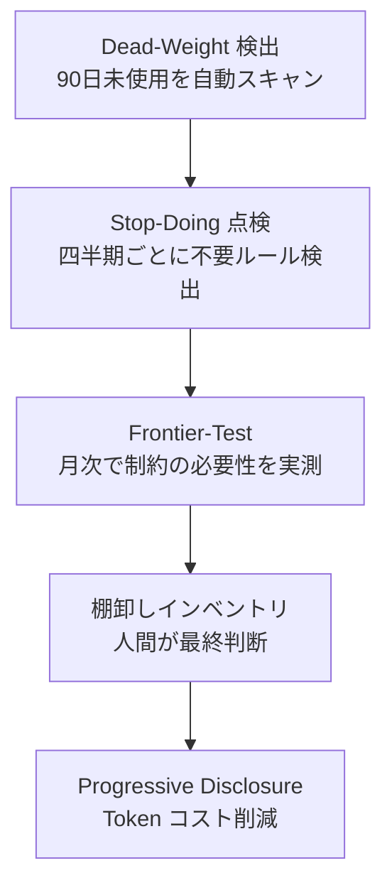

# v3 リリースノート

このファイルは v3 系の累積リリースノートです。最新版が冒頭にあります。

---

## v3.2.0 — Cron HTML メールレポート (Visual Recap Mail)

**コードネーム**: Visual Recap Mail
**リリース日**: 2026-04-17
**ステータス**: ✅ Released (PR #143 squash merged → main `840b338`)

### 主要新機能

Cron で起動された ClaudeCode セッションの完了時に、**HTML 形式のレポートメール**を Gmail SMTP 経由で送信する機能を新設。

| 項目 | 内容 |
|---|---|
| 送信先 | `kensan1969@gmail.com`(`CLAUDEOS_DEFAULT_TO` で変更可) |
| 送信元 | `kensan1969@gmail.com`(`CLAUDEOS_DEFAULT_FROM` で変更可) |
| SMTP | `smtp.gmail.com:587` STARTTLS |
| 認証 | Gmail アプリパスワード(2段階認証必須) |
| トリガー | `CLAUDEOS_EMAIL_ENABLED=1` で明示 opt-in(誤送信防止のため既定 off) |

### メール内容

- ステータス(🟢 completed / 🔴 failed / 🟡 timeout / 🔵 running)
- メタ情報表(プロジェクト/セッション ID/ホスト/開始/終了/総作業時間/予定時間/ログパス)
- 実行サマリー表(Monitor/Development/Verify/Improvement の出現回数 + エラー検出数 + STABLE 達成判定)
- ログ末尾 15 行(ダーク背景・等幅)
- 次フェーズ提案(ステータス連動: failed→Repair / timeout→引継ぎ / STABLE→Release / エラー痕跡→Debug / それ以外→Monitor)

### 新規ファイル

| ファイル | 内容 |
|---|---|
| `Claude/templates/linux/report-and-mail.py` | Python 3 標準ライブラリのみで HTML メール生成・SMTP 送信(531 行) |
| `docs/common/16_HTMLメールレポート設定.md` | Gmail アプリパスワード取得 → 配置 → 検証手順 |

### 改修ファイル

| ファイル | 内容 |
|---|---|
| `Claude/templates/linux/cron-launcher.sh` | finalize で report-and-mail.py を best-effort 呼出し、`CLAUDEOS_EMAIL_ENABLED=1` ガード、timeout 終了(exit 124)を区別 |
| `config/config.json.template` | `email` セクション追加、version "3.1.0"→"3.2.0"、from/to を `<your-email>` プレースホルダ |

### セキュリティ設計

- アプリパスワードは **config.json に書かない**(git commit リスク回避)
- Linux 環境変数 `CLAUDEOS_SMTP_USER` / `CLAUDEOS_SMTP_PASS` で管理
- `~/.env-claudeos` は `chmod 600` 必須
- cron は `~/.bashrc` を読まないため、`source ~/.env-claudeos` を `cron-launcher.sh` 冒頭で実行

### 実機検証

| 項目 | 結果 |
|---|---|
| Python 3 syntax check | ✅ pass |
| `bash -n` syntax check | ✅ pass |
| dry-run HTML 生成 | ✅ 6110 bytes、🟢 アイコン入り |
| 実機 SMTP 送信 | ✅ Gmail 受信成功(session=smoke-1776384212) |

---

## v8.2 — Opus 4.7 最適化(CLAUDE.md カーネル更新)

**コードネーム**: Adaptive Kernel
**リリース日**: 2026-04-17
**ステータス**: ✅ Released (PR #142 squash merged → main `1622363`)

Anthropic 公式 4 ドキュメント(session-mgmt blog, Opus 4.7 best practices, migration guide, changelog v2.1.90-111)の精査結果に基づく ClaudeOS 中核改修。

### マトリクス全 11 項目

| 区分 | 項目 |
|---|---|
| P0 | Token 配分を Opus 4.7 新 tokenizer (1.35x) に再キャリブレーション |
| P0 | Agent Teams 起動時の並列 spawn 明示プリアンブル追加 |
| P0 | `/compact` 事前発動規約(Token 70%/Verify 失敗 3 回/フェーズ切替/rescue 直前/2h 超過) |
| P1 | `task_budget` (beta) 5h 運用に導入 |
| P1 | `ENABLE_PROMPT_CACHING_1H` を CLAUDE.md ブロックに適用 |
| P1 | `/ultrareview` を Verify 必須に統合 |
| P1 | PreCompact hook で state.json 自動退避 |
| P2 | `/recap` セッション開始時必須(自動 fallback 付き) |
| P2 | Push Notification を STABLE/Blocked に接続 |
| P2 | Effort 動的切替(xhigh ⇄ high ⇄ medium) |
| F | 比喩・冗長記述削減・字義通り表現に文体改修 |

### 新規 hook(`.claude/claudeos/scripts/hooks/`)

- `pre-compact.js` — snapshot 退避 + 失敗時 exitCode 2 ブロック
- `session-start.js` — 前回コンテキスト読み出し
- `session-end.js` — last_stop_at 記録 + notify-stable 同期実行
- `suggest-compact.js` — §12 規約のプログラム化
- `notify-stable.js` — STABLE/Blocked/5h/Critical Review 通知

### Critical 対策の 3 層防御

Stop hooks 並列実行による state.json race condition は (a) 1 hook entry 集約 (b) `require()` で同期実行 (c) `writeJsonAtomic` (temp+rename) で完全排除。

---

## v3.0.0 リリースノート（ドラフト）

**コードネーム**: Autonomous Runtime
**目標リリース日**: 2026-10
**ステータス**: Phase 4 — リリース準備中

---

## 概要

v3.0.0 は ClaudeOS の第三世代メジャーリリースです。
**v8 Harness Evolution** により、AI モデルの進化に自律追随するメンテナンスフリーなハーネス設計を実現しました。
また **CodeRabbit 統合**・**段階的コンテキスト開示（Progressive Disclosure）**・**Frontier-Test 月次ループ**によって、
長期的な品質維持コストを大幅に削減する設計に移行しています。

---

## v3.0.0 主要変更点

### 🧠 v8 Harness Evolution（Issue #103〜#109）

| Issue | 内容 | PR |
|---|---|---|
| #103 | Improve ループに **Stop-Doing 点検**を追加（四半期毎に不要ルール検出・Issue 化） | #111 |
| #104 | **2 段階検証 PreToolUse フック**（agent-risk-check）— 別 Claude が SAFE/CAUTION/BLOCK 判定 | #110 |
| #105 | **Agent/Skill 棚卸しインベントリ** 2026Q2 — 101 件中 56 件を削除候補として特定 | #115 |
| #106 | **Progressive Disclosure × state.json** — 3 ティア遅延ロードでセッション開始 token を 80-90% 削減 | #113 |
| #107 | CLAUDE.md に**プロンプトキャッシング breakpoint マーカー**を追加 | 直接コミット |
| #108 | **Dead-Weight 自動検出**（90 日未使用 Agent/Skill を定期スキャン・Issue 化） | #112 |
| #109 | **Frontier-Test 月次ループ**（月次ベンチマークで制約の必要性を自動再評価） | #114 |

### 🔄 新ループ・フック

| 名前 | 種別 | 機能 |
|---|---|---|
| `frontier-test-loop` | Loop (月次) | 10 件のベンチマークタスクで制約の有効/無効を比較し不要判定を自動 Issue 化 |
| `onboarding-refresh-on-stable` | PostToolUse Hook | STABLE 判定到達時に `/team-onboarding` を自動実行して ONBOARDING.md を最新化 |
| `agent-risk-check` | PreToolUse Hook (agent) | Bash/Edit/Write 操作前に第 2 の Claude がリスク判定 |
| `usage-history-recorder` | PostToolUse Hook | Agent/Skill/Command/Hook の呼び出し履歴を state.json に自動記録 |

### 📄 新ファイル・ドキュメント

| ファイル | 内容 |
|---|---|
| `.claude/claudeos/loops/frontier-test-loop.md` | Frontier-Test ループ定義（実行契約 5 ステップ） |
| `.claude/claudeos/frontier/benchmark-tasks.md` | 10 件のベンチマークタスク仕様 |
| `.claude/claudeos/system/progressive-disclosure.md` | 段階的コンテキスト開示プロトコル |
| `state.json.example` | 全スキーマブロック定義（frontier ブロック含む） |
| `docs/agents-skills-inventory-2026Q2.md` | Agent/Skill 棚卸しインベントリ 2026Q2 |

### 🔐 セキュリティ強化（v2.9.x〜v3.0.0）

| 内容 | PR |
|---|---|
| PSScriptAnalyzer lint ジョブを CI に追加 | #98 |
| Dependabot 設定追加（依存関係自動更新） | #94 |
| CI permissions を `contents: read` に制限 | #93 |
| SECURITY.md 追加 | #97 |
| gitleaks シークレットスキャン | #98 |

---

## v2.9.0 から v3.0.0 への主要変更サマリー

### 追加された自律化機能



### state.json スキーマ変更

v2.9.0 から追加されたブロック:

| ブロック | 追加バージョン | 主要フィールド |
|---|---|---|
| `session.context_load_tier` | v3.0.0 | `minimal` / `standard` / `full` |
| `improvement.stop_doing_*` | v3.0.0 | 四半期点検日・結果カウント |
| `learning.usage_history` | v3.0.0 | agents / skills / commands / hooks の呼び出し履歴 |
| `learning.dead_weight` | v3.0.0 | stale 検出閾値・候補リスト |
| `frontier.*` | v3.0.0 | 月次テスト日・削除候補・低利用候補 |

---

## Phase 4 残タスク

| タスク | 状態 | 担当 | 優先度 |
|---|---|---|---|
| リリースノート作成 | 🔄 本ドキュメント（ドラフト） | ScrumMaster | P2 |
| E2E テスト整備 | ✅ PR #125 マージ済み (2026-04-15) | QA | P2 |
| GitHub Release タグ作成（v3.0.0） | ⏸ 未着手（milestone: 2026-10） | DevOps | P2 |
| 棚卸し削除実行（55 件） | ✅ PR #122 マージ済み (2026-04-15) | EvolutionManager | P3 |
| safety-check hook 削除（#121） | ✅ PR #123 マージ済み (2026-04-15) | EvolutionManager | P3 |

---

## テスト結果（v2.9.x 時点）

| テスト種別 | 結果 |
|---|---|
| Pester（PowerShell） | 311 / 311 PASS |
| E2E（Pester） | 122 / 122 PASS |
| GitHub Actions CI | ✅ 全ジョブ SUCCESS |
| gitleaks シークレットスキャン | ✅ PASS |
| PSScriptAnalyzer lint | ✅ PASS |
| CodeRabbit レビュー | ✅ PASS |

---

## 既知の制限事項

- `state.json` はランタイム状態のためコミット対象外（`state.json.example` を参照）
- GitHub Release タグ `v3.0.0` は milestone 2026-10 で未作成（`gh release create v3.0.0` で作成予定）

---

## インストール / アップグレード

```bash
# 既存環境のスキーマ更新
cp state.json.example state.json

# または既存の state.json に frontier ブロックを手動追加
# 参照: state.json.example の frontier セクション
```

---

## 変更履歴

| バージョン | 日付 | 主な変更 |
|---|---|---|
| v2.7.0 | 2026-04 | MCP ヘルスチェック・Agent Teams ランタイム |
| v2.8.0 | 2026-05 | Worktree 並列開発・Issue 自動生成 |
| v2.9.0 | 2026-04-14 | ダッシュボード・Memory MCP・自己進化システム |
| v3.0.0 | 2026-10 (予定) | Harness Evolution・Progressive Disclosure・Frontier-Test |
